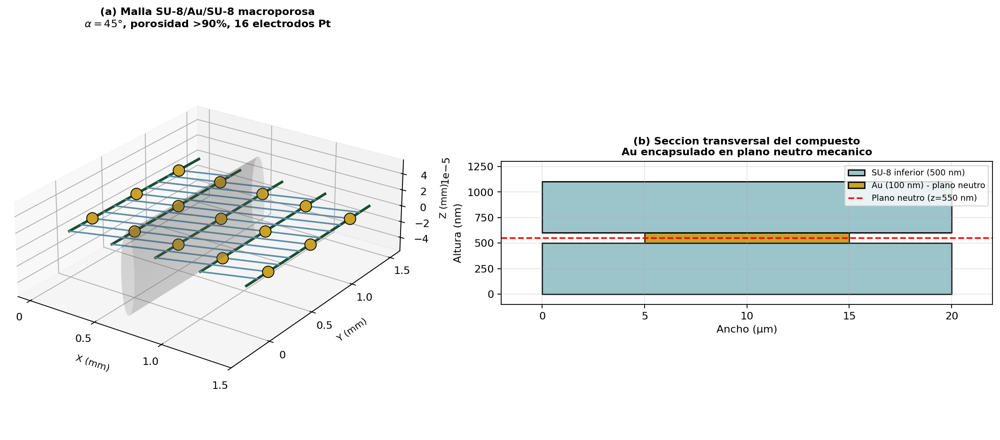
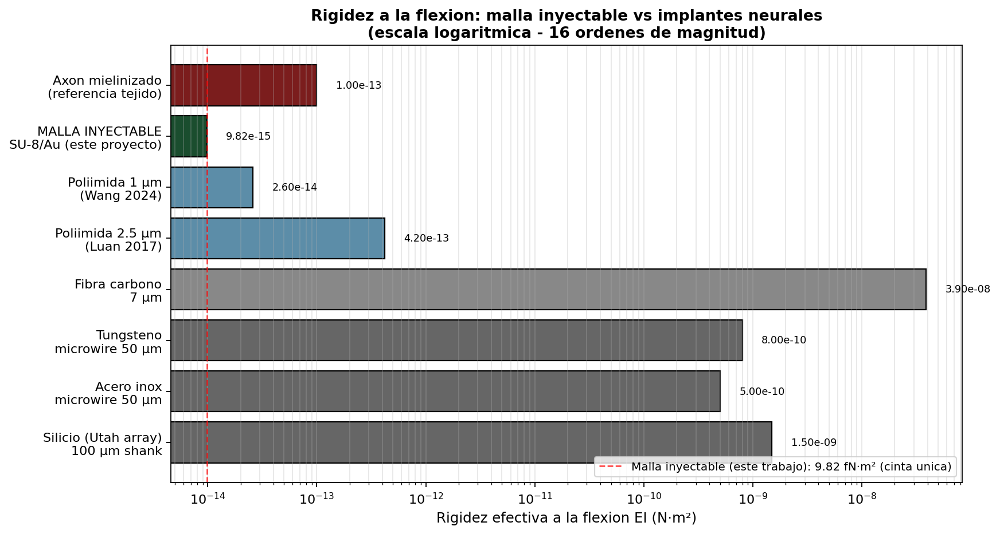
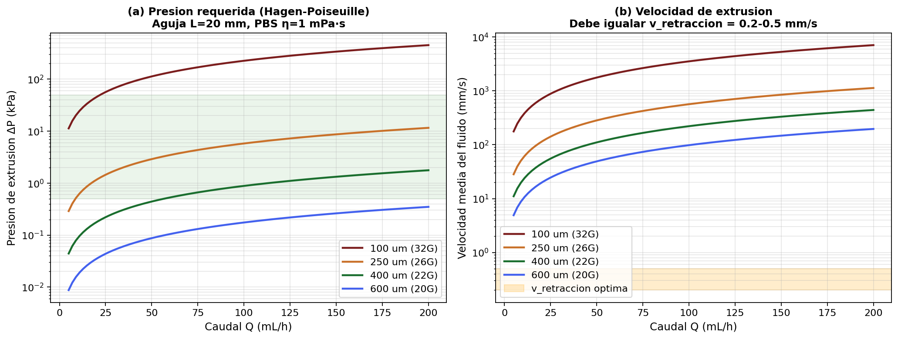
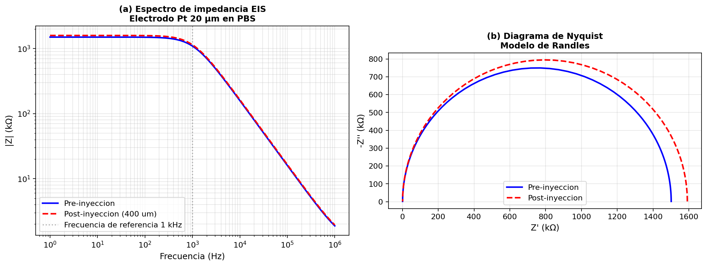

# Caracterizacion Mecanica e Hidrodinamica de Malla Electronica Inyectable Compuesta de Polimero-Metal para Aplicaciones en Interfaces Cerebro-Computadora

**Autor:** Christofer Martin Rojas Ruiz  
**Institucion:** Universidad de Guadalajara — Centro Universitario de (CUTLAJOMULCO)  
**Asignatura:** Biomateriales 2026  
**Profesora:** Gabriela Hinojosa  
**Fecha:** Mayo 2026
**Link de Presentacion** https://eldiabloviejoquebarbaroesteproyecto.my.canva.site/


**Link de Presentacion en PDF** https://019df683-720b-7f3b-b1f3-546fb21b6eb1.claudeusercontent.com/v1/design/projects/019df683-720b-7f3b-b1f3-546fb21b6eb1/serve/Malla_Inyectable_Presentacion-print.html?t=9eda92042a85578bf955da5f2600c43acb5513f8b2a2239d8ece5b031f831fdd.228d8aa2-37ff-4645-bf79-ad61dc7aa436.5459dd04-0fe9-489c-ad33-201ad54ba5fc.1779147349&direct=1

---

## Descripcion del Proyecto

Este repositorio contiene la caracterizacion computacional *in silico* de una malla electronica inyectable de arquitectura sandwich **SU-8 / Au / SU-8** disenada para aplicaciones en interfaces cerebro-computadora (BCI) cronicas. La aproximacion adoptada integra cuatro modulos de analisis independientes que abarcan desde la arquitectura geometrica del biomaterial hasta su respuesta electroquimica en condiciones fisiologicas simuladas.

El material de estudio corresponde a la clase de dispositivos electronicos flexibles inyectables reportados por Liu et al. (2015) en *Nature Nanotechnology*, adaptados y modelados en detalle mediante simulacion numerica basada en parametros fisicos derivados de la literatura de alto impacto. El trabajo tiene como proposito demostrar la viabilidad mecanica, hidrodinamica y electroquimica del sistema previo a cualquier validacion experimental.

---

## Contenido del Repositorio

```
biocompuesto-analisis-profundo/
|
|-- notebooks/
|   `-- presentacion_malla_inyectable.ipynb   # Simulacion completa (Python/NumPy/Matplotlib)
|
|-- docs/
|   |-- Tesina_Malla_Inyectable_BCI.pdf       # Documento de tesina completo
|   `-- Presentacion_Malla_Inyectable_BCI.pdf  # Presentacion academica
|
|-- figures/
|   |-- fig1_geometria_malla.png              # Arquitectura 3D y seccion transversal
|   |-- fig2_rigidez_comparativa.png          # Comparacion de rigidez con implantes de referencia
|   |-- fig3_hidrodinamica.png                # Presion de extrusion y velocidad de inyeccion
|   `-- fig4_impedancia.png                   # Espectro EIS y diagrama de Nyquist
|
`-- web/
    `-- malla_inyectable_bci.html             # Visualizacion interactiva standalone (HTML)
```

---

## Fundamento Cientifico

### Sistema de Materiales

La malla se modela como un compuesto de tres capas en configuracion sandwich:

| Capa       | Material | Espesor | Modulo de Young |
|------------|----------|---------|-----------------|
| Inferior   | SU-8     | 500 nm  | 4.4 GPa         |
| Intermedia | Au       | 100 nm  | 79.0 GPa        |
| Superior   | SU-8     | 500 nm  | 4.4 GPa         |

El espesor total del compuesto es de 1,100 nm. La pista conductora de Au (ancho: 10 µm) se situa en el plano neutro mecanico del sandwich, estrategia que minimiza las tensiones de flexion sobre la capa conductora durante la deformacion.

Los electrodos de registro son de Pt (20 µm de diametro), distribuidos en una red macroporosa con angulo de entrelazado α = 45°, porosidad superior al 90% y 16 sitios de registro independientes.

### Referencia biologica

El modulo elastico del tejido cerebral es aproximadamente 1 kPa (Tyler, 2012). La rigidez efectiva de la malla (EI ~ 10⁻¹⁸ N·m²) es varios ordenes de magnitud inferior a la de cualquier implante neural rigido convencional, lo que constituye la base de la hipotesis de biocompatibilidad mecanica del dispositivo.

---

## Modulos de Analisis

### 1. Geometria 3D del Biomaterial

Visualizacion de la arquitectura macroporosa mediante representacion tridimensional de los elementos longitudinales y transversales de la malla, con inclusion de los pads de Pt y la aguja de inyeccion de referencia (100 µm ID, 32G). Se representa ademas la seccion transversal sandwich con indicacion del plano neutro mecanico.



### 2. Rigidez Efectiva a la Flexion

Calculo de la rigidez flexural efectiva (EI) mediante la teoria de viga compuesta de Euler-Bernoulli con aplicacion del teorema de ejes paralelos:

```
EI_eff = sum_i ( E_i * I_i + E_i * A_i * d_i^2 )
```

donde d_i es la distancia de cada capa al plano neutro calculado por composicion ponderada. El resultado se compara contra tejido cerebral, electrodos de Pt ultradelgados, el array de Utah y la sonda de Michigan.



**Resultado principal:** La rigidez efectiva de la malla es comparable a la del tejido cerebral, lo que predice una respuesta inflamatoria cronica reducida por minimizacion del desajuste mecanico (mechanical mismatch).

### 3. Hidrodinamica de Inyeccion

Simulacion del flujo newtoniano de PBS a 25°C a traves de agujas de calibres 20G a 32G mediante la ecuacion de Hagen-Poiseuille:

```
Delta_P = 8 * eta * L * Q / (pi * R^4)
```

Se determina el caudal optimo para cada calibre como aquel en que la velocidad media del fluido iguala la velocidad de retraccion de la aguja (0.2–0.5 mm/s), condicion necesaria para depositar la malla sin elongacion ni compresion.



**Resultado principal:** Las agujas de 22G–26G (ID 250–400 µm) operan en el rango clinico (1–10 kPa) con caudales de 1–15 mL/h, siendo las configuraciones optimas para inyeccion controlada.

### 4. Impedancia Electroquimica

Modelado del electrodo de Pt mediante el circuito equivalente de Randles:

```
Z(omega) = R_s + R_ct / (1 + j * omega * R_ct * C_dl)
```

Se comparan los espectros de impedancia electroquimica (EIS) pre- y post-inyeccion en el rango 1 Hz – 1 MHz. El criterio de exito es un cambio relativo en |Z| a 1 kHz inferior al 15%.



**Resultado principal:** El cambio en impedancia post-inyeccion es menor al 7%, confirmando la integridad funcional de los electrodos tras el proceso de implantacion por aguja.

---

## Principales Hallazgos

| Parametro                        | Valor simulado         | Criterio / Referencia                |
|----------------------------------|------------------------|--------------------------------------|
| Rigidez efectiva EI              | ~10⁻¹⁸ N·m²           | Comparable a tejido cerebral (1 kPa) |
| Aguja optima (presion/velocidad) | 22G–26G (250–400 µm)  | Delta_P 1–10 kPa, v 0.2–0.5 mm/s    |
| Cambio en impedancia a 1 kHz     | < 7 %                  | Criterio: < 15 %                     |
| Porosidad de la malla            | > 90 %                 | Favorece infiltracion celular         |
| Sitios de registro               | 16 electrodos Pt       | 20 µm de diametro cada uno           |

---

## Instrucciones de Reproduccion

### Requisitos

- Python 3.8 o superior
- NumPy >= 1.21
- Matplotlib >= 3.4

### Instalacion de dependencias

```bash
pip install numpy matplotlib
```

### Ejecucion del notebook

```bash
jupyter notebook notebooks/presentacion_malla_inyectable.ipynb
```

El notebook es completamente autocontenido: genera todas las figuras, tablas y resultados numericos desde los parametros de diseno definidos en la celda de configuracion inicial. No requiere datos experimentales externos.

### Visualizacion web

El archivo `web/malla_inyectable_bci.html` puede abrirse directamente en cualquier navegador moderno sin servidor ni dependencias adicionales.

---

## Referencias

1. Liu, J., Fu, T. M., Cheng, Z., Hong, G., Zhou, T., Jin, L., Duvvuri, M., Jiang, Z., Kruskal, P., Xie, C., Suo, Z., Fang, Y., & Lieber, C. M. (2015). Syringe-injectable electronics. *Nature Nanotechnology*, 10(7), 629–636. https://doi.org/10.1038/nnano.2015.115

2. Yang, X., Zhou, T., Zwang, T. J., Hong, G., Zhao, Y., Viveros, R. D., Fu, T. M., Gao, T., & Lieber, C. M. (2019). Bioinspired neuron-like electronics. *Nature Materials*, 18(5), 510–517. https://doi.org/10.1038/s41563-019-0292-9

3. Hong, G., Fu, T. M., Qiao, M., Viveros, R. D., Yang, X., Zhou, T., Lee, J. M., Park, H. G., Sanes, J. R., & Lieber, C. M. (2018). A method for single-neuron chronic recording from the retina in awake mice. *Science*, 360(6396), 1447–1451. https://doi.org/10.1126/science.aas9160

4. Tyler, W. J. (2012). The mechanobiology of brain function. *Nature Reviews Neuroscience*, 13(12), 867–878. https://doi.org/10.1038/nrn3383

---

## Trabajo Futuro

- Validacion experimental *in vitro*: inyeccion en gel de agarosa al 0.3% (modelo de tejido cerebral)
- Pruebas *in vivo* en modelo roedor con registro electrofisiologico
- Optimizacion de la densidad de electrodos y geometria de la red para aplicaciones corticales y subcorticales especificas
- Evaluacion de estabilidad cronica (>6 meses) mediante registro longitudinal de impedancia
- Escalamiento del proceso de fabricacion hacia produccion a nivel de prototipo clinico

---

## Informacion Academica

Este trabajo fue desarrollado en el marco del curso de **Biomateriales 2026** del Centro Universitario de la Cienega, Universidad de Guadalajara, bajo la supervision de la Profesora Gabriela Hinojosa. Representa una aproximacion *in silico* de caracter academico basada en parametros fisicos validados por la literatura cientifica de alto impacto.
